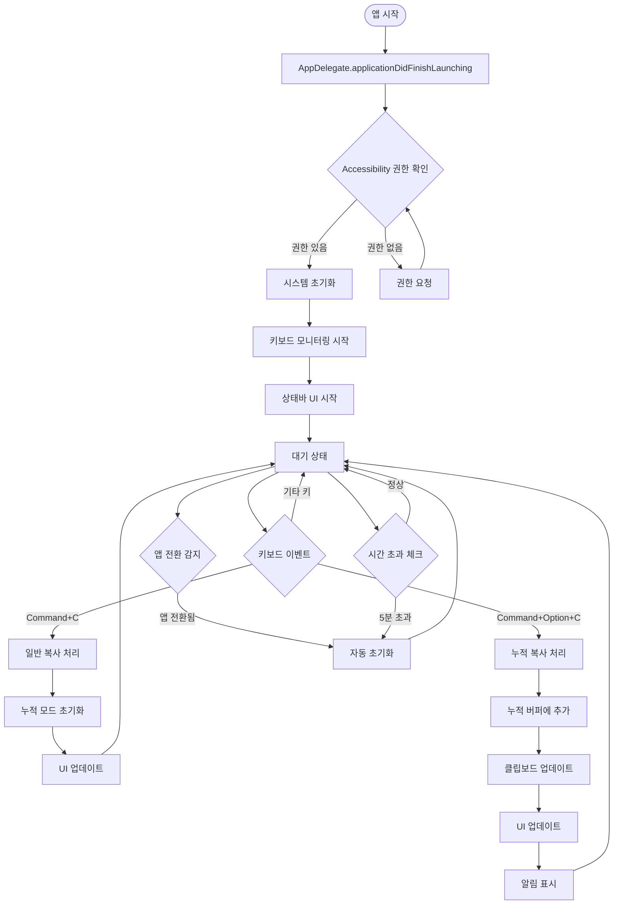

# Extended Copy - 프로그램 워크플로우

## 📋 개요
이 문서는 Extended Copy 프로그램의 전체 실행 흐름과 함수별 역할을 시각적으로 설명합니다.
각 상황별로 어떤 함수가 호출되고, 함수 간의 상호작용이 어떻게 이루어지는지 상세히 기술합니다.

---

## 🏗 전체 시스템 아키텍처 플로우



---

## 🔧 핵심 함수 정의 및 역할

### 1. App Lifecycle 함수들

#### `AppDelegate.applicationDidFinishLaunching(_:)`
**역할**: 앱 시작 시 전체 시스템 초기화
```swift
func applicationDidFinishLaunching(_ notification: Notification) {
    setupLogging()
    checkPermissions()
    initializeServices()
    startKeyboardMonitoring()
    setupStatusBar()
    setupSystemEventHandlers()
}
```
**호출하는 함수**: 
- `PermissionManager.checkAccessibilityPermission()`
- `KeyboardEventMonitor.startMonitoring()`
- `StatusBarController.setup()`

#### `AppDelegate.applicationWillTerminate(_:)`
**역할**: 앱 종료 시 정리 작업
```swift
func applicationWillTerminate(_ notification: Notification) {
    cleanup()
    stopKeyboardMonitoring()
    clearClipboardData()
}
```

---

### 2. Permission Management 함수들

#### `PermissionManager.checkAccessibilityPermission() -> Bool`
**역할**: Accessibility 권한 상태 확인
```swift
func checkAccessibilityPermission() -> Bool {
    let trusted = AXIsProcessTrusted()
    logger.info("Accessibility permission: \(trusted)")
    return trusted
}
```

#### `PermissionManager.requestAccessibilityPermission()`
**역할**: Accessibility 권한 요청
```swift
func requestAccessibilityPermission() {
    let options = [kAXTrustedCheckOptionPrompt.takeUnretainedValue(): true]
    AXIsProcessTrustedWithOptions(options as CFDictionary)
    
    showPermissionGuidance()
}
```
**호출하는 함수**:
- `NotificationManager.showPermissionDialog()`

---

### 3. Keyboard Event Monitoring 함수들

#### `KeyboardEventMonitor.startMonitoring()`
**역할**: 전역 키보드 이벤트 모니터링 시작
```swift
func startMonitoring() {
    guard checkPermissions() else { return }
    
    let eventMask = (1 << CGEventType.keyDown.rawValue)
    eventTap = CGEvent.tapCreate(
        tap: .cgSessionEventTap,
        place: .headInsertEventTap,
        options: .defaultTap,
        eventsOfInterest: CGEventMask(eventMask),
        callback: handleKeyboardEvent,
        userInfo: nil
    )
    
    startEventTap()
}
```
**호출하는 함수**:
- `handleKeyboardEvent(_:_:_:_:)`

#### `handleKeyboardEvent(_:_:_:_:) -> Unmanaged<CGEvent>?`
**역할**: 키보드 이벤트 분석 및 라우팅
```swift
private func handleKeyboardEvent(
    proxy: CGEventTapProxy, 
    type: CGEventType, 
    event: CGEvent, 
    refcon: UnsafeMutableRawPointer?
) -> Unmanaged<CGEvent>? {
    
    let keyCode = event.getIntegerValueField(.keyboardEventKeycode)
    let flags = event.flags
    
    // C 키 (keyCode 8) 감지
    guard keyCode == 8 else {
        return Unmanaged.passUnretained(event)
    }
    
    if flags.contains([.maskCommand, .maskAlternate]) {
        // Command + Option + C
        handleAccumulativeCopy()
        return nil // 이벤트 소비
    } else if flags.contains(.maskCommand) && !flags.contains(.maskAlternate) {
        // Command + C
        handleNormalCopy()
        // 이벤트는 시스템으로 전달 (기존 동작 유지)
    }
    
    return Unmanaged.passUnretained(event)
}
```
**호출하는 함수**:
- `ClipboardCoordinator.handleAccumulativeCopy()`
- `ClipboardCoordinator.handleNormalCopy()`

---

### 4. Clipboard Management 함수들

#### `ClipboardManager.getCurrentText() -> String?`
**역할**: 현재 클립보드 텍스트 가져오기
```swift
func getCurrentText() -> String? {
    let pasteboard = NSPasteboard.general
    
    guard let types = pasteboard.types,
          types.contains(.string) else {
        logger.debug("No text content in clipboard")
        return nil
    }
    
    let text = pasteboard.string(forType: .string)
    logger.debug("Retrieved clipboard text: \(text?.prefix(50) ?? "nil")...")
    return text
}
```

#### `ClipboardManager.setText(_:)`
**역할**: 클립보드에 텍스트 설정
```swift
func setText(_ text: String) {
    let pasteboard = NSPasteboard.general
    pasteboard.clearContents()
    pasteboard.setString(text, forType: .string)
    
    logger.debug("Set clipboard text: \(text.prefix(50))...")
}
```

#### `AccumulativeClipboard.addItem(_:) -> Result<Void, ClipboardError>`
**역할**: 누적 버퍼에 새 텍스트 추가
```swift
func addItem(_ text: String) -> Result<Void, ClipboardError> {
    // 입력 유효성 검사
    guard !text.isEmpty else {
        return .failure(.emptyText)
    }
    
    guard text.count <= Constants.maxTextLength else {
        return .failure(.textTooLarge(text.count))
    }
    
    // 누적 버퍼에 추가
    items.append(text)
    
    // 메모리 관리
    enforceMemoryLimits()
    
    // 상태 업데이트
    updateState(.accumulating(count: items.count))
    
    logger.info("Added item to accumulative clipboard. Total: \(items.count)")
    return .success(())
}
```
**호출하는 함수**:
- `enforceMemoryLimits()`
- `updateState(_:)`

#### `AccumulativeClipboard.getAllContent() -> String`
**역할**: 누적된 모든 텍스트를 구분자로 결합하여 반환
```swift
func getAllContent() -> String {
    let content = items.joined(separator: configuration.separator)
    logger.debug("Generated accumulated content: \(content.count) characters")
    return content
}
```

#### `AccumulativeClipboard.reset()`
**역할**: 누적 버퍼 초기화
```swift
func reset() {
    let previousCount = items.count
    items.removeAll()
    updateState(.normal)
    
    logger.info("Reset accumulative clipboard. Previous count: \(previousCount)")
}
```
**호출하는 함수**:
- `updateState(_:)`

---

### 5. Coordination 함수들

#### `ClipboardCoordinator.handleAccumulativeCopy()`
**역할**: Command+Option+C 처리 총괄
```swift
func handleAccumulativeCopy() {
    logger.info("Handling accumulative copy")
    
    // 1. 현재 클립보드 텍스트 가져오기
    guard let currentText = clipboardManager.getCurrentText() else {
        logger.warning("No text to copy")
        notificationManager.showWarning("No text selected")
        return
    }
    
    // 2. 누적 버퍼에 추가
    let result = accumulativeClipboard.addItem(currentText)
    
    switch result {
    case .success():
        // 3. 누적된 전체 내용을 클립보드에 설정
        let allContent = accumulativeClipboard.getAllContent()
        clipboardManager.setText(allContent)
        
        // 4. UI 업데이트
        updateStatusBarUI()
        
        // 5. 사용자 알림
        let itemCount = accumulativeClipboard.itemCount
        notificationManager.showSuccess("\(itemCount)개 항목 누적됨")
        
        logger.info("Accumulative copy successful. Total items: \(itemCount)")
        
    case .failure(let error):
        handleClipboardError(error)
    }
}
```
**호출하는 함수**:
- `ClipboardManager.getCurrentText()`
- `AccumulativeClipboard.addItem(_:)`
- `AccumulativeClipboard.getAllContent()`
- `ClipboardManager.setText(_:)`
- `updateStatusBarUI()`
- `NotificationManager.showSuccess(_:)`

#### `ClipboardCoordinator.handleNormalCopy()`
**역할**: Command+C 처리 (누적 모드 초기화)
```swift
func handleNormalCopy() {
    logger.info("Handling normal copy - resetting accumulative mode")
    
    // 누적 모드가 활성화되어 있었다면 초기화
    if accumulativeClipboard.isAccumulating {
        accumulativeClipboard.reset()
        updateStatusBarUI()
        
        logger.info("Accumulative mode reset due to normal copy")
    }
    
    // 일반 복사는 시스템이 처리하도록 함
}
```
**호출하는 함수**:
- `AccumulativeClipboard.reset()`
- `updateStatusBarUI()`

---

### 6. UI Update 함수들

#### `StatusBarController.updateIcon(_:)`
**역할**: 상태바 아이콘 업데이트
```swift
func updateIcon(_ state: ClipboardState) {
    let iconText = state.statusBarIcon
    
    DispatchQueue.main.async { [weak self] in
        self?.statusItem.button?.title = iconText
        self?.updateAccessibilityInfo(state)
    }
    
    logger.debug("Status bar icon updated: \(iconText)")
}
```
**호출하는 함수**:
- `updateAccessibilityInfo(_:)`

#### `StatusBarController.updateAccessibilityInfo(_:)`
**역할**: 접근성 정보 업데이트
```swift
private func updateAccessibilityInfo(_ state: ClipboardState) {
    guard let button = statusItem.button else { return }
    
    let accessibilityText = state.accessibilityDescription
    button.accessibilityValue = accessibilityText
    
    logger.debug("Accessibility info updated: \(accessibilityText)")
}
```

#### `NotificationManager.showSuccess(_:)`
**역할**: 성공 알림 표시
```swift
func showSuccess(_ message: String) {
    showNotification(message, type: .success)
}

private func showNotification(_ message: String, type: NotificationType) {
    DispatchQueue.main.async { [weak self] in
        self?.displayToastNotification(message, type: type)
    }
    
    logger.info("Notification shown: \(message)")
}
```

---

### 7. System Event Handling 함수들

#### `SystemEventManager.setupAppSwitchDetection()`
**역할**: 앱 전환 감지 설정
```swift
func setupAppSwitchDetection() {
    NSWorkspace.shared.notificationCenter.addObserver(
        forName: NSWorkspace.didActivateApplicationNotification,
        object: nil,
        queue: .main
    ) { [weak self] notification in
        self?.handleAppSwitch(notification)
    }
}
```
**호출하는 함수**:
- `handleAppSwitch(_:)`

#### `SystemEventManager.handleAppSwitch(_:)`
**역할**: 앱 전환 시 자동 초기화 처리
```swift
private func handleAppSwitch(_ notification: Notification) {
    guard let app = notification.userInfo?[NSWorkspace.applicationUserInfoKey] as? NSRunningApplication else { return }
    
    // 다른 앱으로 전환된 경우
    if app.bundleIdentifier != Bundle.main.bundleIdentifier {
        logger.info("App switched to: \(app.localizedName ?? "Unknown")")
        coordinator.resetAccumulativeMode()
    }
}
```
**호출하는 함수**:
- `ClipboardCoordinator.resetAccumulativeMode()`

#### `SystemEventManager.startTimeoutTimer()`
**역할**: 시간 기반 자동 초기화 타이머 시작
```swift
func startTimeoutTimer() {
    stopTimeoutTimer() // 기존 타이머 정리
    
    timeoutTimer = Timer.scheduledTimer(withTimeInterval: Constants.autoResetTimeout, repeats: false) { [weak self] _ in
        self?.handleTimeout()
    }
}

private func handleTimeout() {
    logger.info("Auto-reset triggered by timeout")
    coordinator.resetAccumulativeMode()
}
```
**호출하는 함수**:
- `ClipboardCoordinator.resetAccumulativeMode()`

---

## 🔄 주요 워크플로우 시나리오

### 시나리오 1: 앱 시작 워크플로우

```
1. main() 
   └── AppDelegate.applicationDidFinishLaunching()
       ├── Logger.setup()
       ├── PermissionManager.checkAccessibilityPermission()
       │   ├── [권한 없음] → PermissionManager.requestAccessibilityPermission()
       │   └── [권한 있음] → 계속
       ├── ServiceFactory.createServices()
       ├── KeyboardEventMonitor.startMonitoring()
       ├── StatusBarController.setup()
       ├── SystemEventManager.setupEventHandlers()
       └── ClipboardCoordinator.initialize()
```

### 시나리오 2: Command+Option+C 누적 복사 워크플로우

```
1. 사용자가 텍스트 선택 후 Command+Option+C 입력
   └── KeyboardEventMonitor.handleKeyboardEvent()
       └── [Command+Option+C 감지] 
           └── ClipboardCoordinator.handleAccumulativeCopy()
               ├── ClipboardManager.getCurrentText()
               │   └── NSPasteboard.general.string(forType: .string)
               ├── AccumulativeClipboard.addItem(currentText)
               │   ├── [유효성 검사]
               │   ├── items.append(text)
               │   ├── enforceMemoryLimits()
               │   └── updateState(.accumulating(count))
               ├── AccumulativeClipboard.getAllContent()
               │   └── items.joined(separator: "\n")
               ├── ClipboardManager.setText(allContent)
               │   └── NSPasteboard.general.setString()
               ├── StatusBarController.updateIcon(newState)
               │   └── statusItem.button?.title = "📋2"
               ├── NotificationManager.showSuccess("2개 항목 누적됨")
               │   └── displayToastNotification()
               └── SystemEventManager.startTimeoutTimer()
```

### 시나리오 3: Command+C 일반 복사 (초기화) 워크플로우

```
1. 사용자가 Command+C 입력
   └── KeyboardEventMonitor.handleKeyboardEvent()
       ├── [Command+C 감지, 시스템으로 이벤트 전달]
       └── ClipboardCoordinator.handleNormalCopy()
           ├── AccumulativeClipboard.isAccumulating 체크
           │   └── [true인 경우] AccumulativeClipboard.reset()
           │       ├── items.removeAll()
           │       └── updateState(.normal)
           ├── StatusBarController.updateIcon(.normal)
           │   └── statusItem.button?.title = "📋"
           └── SystemEventManager.stopTimeoutTimer()
```

### 시나리오 4: 앱 전환 자동 초기화 워크플로우

```
1. 사용자가 다른 앱으로 전환
   └── NSWorkspace.didActivateApplicationNotification 발생
       └── SystemEventManager.handleAppSwitch()
           ├── [다른 앱 감지]
           └── ClipboardCoordinator.resetAccumulativeMode()
               ├── AccumulativeClipboard.reset()
               │   ├── items.removeAll()
               │   └── updateState(.normal)
               ├── StatusBarController.updateIcon(.normal)
               └── SystemEventManager.stopTimeoutTimer()
```

### 시나리오 5: 시간 초과 자동 초기화 워크플로우

```
1. 5분간 비활성 상태
   └── Timer.scheduledTimer 콜백 실행
       └── SystemEventManager.handleTimeout()
           └── ClipboardCoordinator.resetAccumulativeMode()
               ├── AccumulativeClipboard.reset()
               ├── StatusBarController.updateIcon(.normal)
               └── Logger.info("Auto-reset by timeout")
```

---

## 🚨 에러 처리 워크플로우

### 권한 오류 처리

```
PermissionManager.checkAccessibilityPermission() 
└── [false 반환]
    └── NotificationManager.showPermissionDialog()
        ├── "권한이 필요합니다" 메시지 표시
        ├── "설정으로 이동" 버튼
        └── PermissionManager.openSystemPreferences()
```

### 클립보드 오류 처리

```
AccumulativeClipboard.addItem() 
└── [.failure(ClipboardError) 반환]
    └── ClipboardCoordinator.handleClipboardError()
        ├── [.textTooLarge] → NotificationManager.showError("텍스트가 너무 큽니다")
        ├── [.permissionDenied] → NotificationManager.showPermissionDialog()
        └── [.systemUnavailable] → NotificationManager.showError("시스템 오류")
```

### 메모리 부족 처리

```
AccumulativeClipboard.enforceMemoryLimits()
├── calculateCurrentMemoryUsage()
├── [한계 초과 시] trimOldestItems()
│   ├── items.removeFirst(count/2)
│   └── Logger.warning("Memory limit reached, trimmed items")
└── NotificationManager.showWarning("메모리 절약을 위해 오래된 항목 삭제됨")
```

---

## 📊 성능 모니터링 워크플로우

### 메모리 사용량 모니터링

```
Timer.scheduledTimer(매 10초)
└── PerformanceMonitor.checkMemoryUsage()
    ├── getCurrentMemoryUsage()
    ├── [임계치 초과] → AccumulativeClipboard.enforceMemoryLimits()
    └── Logger.info("Memory usage: \(usage)MB")
```

### 응답 시간 측정

```
모든 주요 함수 실행 시:
Logger.measurePerformance("함수명") {
    // 실제 함수 실행
}
└── [실행 시간 > 1초] → Logger.warning("Slow operation detected")
```

---

## 🔧 상태 관리 워크플로우

### ClipboardState 상태 전이

```
.normal 
├── Command+Option+C → .accumulating(count: 1)
└── [유지]

.accumulating(count: n)
├── Command+Option+C → .accumulating(count: n+1)
├── Command+C → .normal
├── 앱 전환 → .normal
├── 시간 초과 → .normal
└── 메모리 한계 → .accumulating(count: reduced)
```

### UI 상태 동기화

```
ClipboardState 변경 시:
└── Combine Publisher 방출
    └── StatusBarViewModel.$statusIcon 업데이트
        └── StatusBarController UI 반영
            ├── statusItem.button?.title 변경
            └── accessibilityValue 업데이트
```

---

## 🎯 핵심 함수 호출 빈도 및 성능 목표

### 고빈도 호출 함수 (성능 중요)
- `handleKeyboardEvent()` - 모든 키 입력시 (목표: <1ms)
- `getCurrentText()` - 복사 시마다 (목표: <10ms)
- `updateIcon()` - 상태 변경시 (목표: <5ms)

### 중간빈도 호출 함수
- `addItem()` - 누적 복사시 (목표: <50ms)
- `getAllContent()` - 누적 복사시 (목표: <100ms)
- `handleAppSwitch()` - 앱 전환시 (목표: <20ms)

### 저빈도 호출 함수
- `reset()` - 초기화시 (목표: <200ms)
- `enforceMemoryLimits()` - 메모리 관리시 (목표: <500ms)
- `setupEventHandlers()` - 앱 시작시 (목표: <1000ms)

---

## 📝 워크플로우 요약

Extended Copy 프로그램은 다음과 같은 주요 워크플로우로 구성됩니다:

1. **초기화 워크플로우**: 권한 확인 → 서비스 시작 → UI 설정
2. **누적 복사 워크플로우**: 키 감지 → 텍스트 추출 → 누적 → 클립보드 업데이트 → UI 반영
3. **일반 복사 워크플로우**: 키 감지 → 누적 모드 초기화 → UI 복원
4. **자동 초기화 워크플로우**: 트리거 감지 → 상태 초기화 → UI 복원
5. **에러 처리 워크플로우**: 오류 감지 → 사용자 알림 → 복구 시도

각 워크플로우는 명확한 책임 분리와 에러 처리를 통해 안정적이고 예측 가능한 동작을 보장합니다.